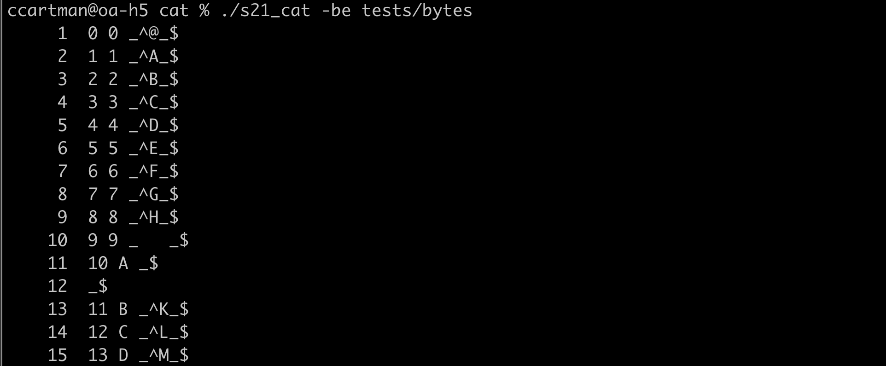
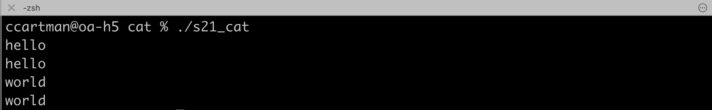
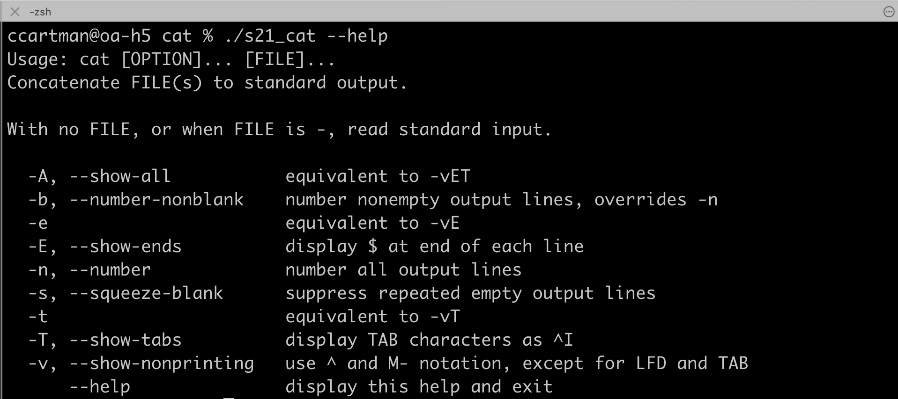

# cat
- cat is a standard Unix utility that reads files sequentially, writing them to standard output. The name is derived from its function to (con)catenate files (from Latin catenare, "to chain"). It has been ported to a number of operating systems.
- The other primary purpose of cat, aside from concatenation, is file printing — allowing the computer user to view the contents of a file. Printing is the most common use of cat.

## Subject
- [Subject EN](./docs/subject_en.md)
- [Subject RUS](./docs/subject_rus.md)

The grep project is located in another repository.

## Usage

- `$>./s21_cat [-bestv]  filenames...` \
  

- A program without arguments or with the "-" argument works with standard input. \
  

- A help message \
  

